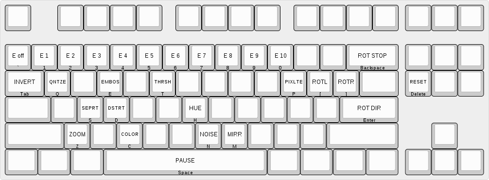

Videofeedback
=============

Common
------

| key | desc |
|-----|---------|
| Space  | pause |
| Delete | reset all |
| Tab    | invert |

Rotation
--------

| key | desc |
|-----|---------|
| [ | rotate left |
| ] | rotate right |
| Enter | change rotation direction |
| Backspace | stop rotation, reset rotation |

Effects
-------

Press letter first, then set amount of effect:

| key | desc |
|-----|---------|
| ` | effect off |
| 1 | 10% effect |
| 2 | 20% effect |
| 3 | 30% effect |
| 4 | 40% effect |
| 5 | 50% effect |
| 6 | 60% effect |
| 7 | 70% effect |
| 8 | 80% effect |
| 9 | 90% effect |
| 0 | 100% effect |

| key | desc |
|-----|---------|
| M | mirror (7 is max) |
| C | colormap (6 is max) |
| T | blackwhite threshold |
| Q | quantize |
| E | emboss |
| N | noise |
| D | desaturate |
| S | separation |
| P | pixelate |
| H | hue |
