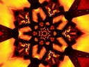
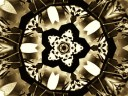
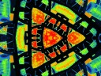
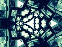
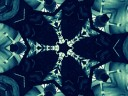
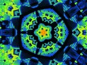

Videofeedback
=============

The following Python packages are needed:

```
python-opencv
python-opengl
```

Examples
--------

     

Keyboard layout
---------------


Common controls
----------------

| key | desc |
|-----|---------|
| `Space`  | Pause |
| `Delete` | Reset All |
| `Tab`    | Invert |

Rotation controls
-----------------

| key | desc |
|-----|---------|
| `[` | Rotate Left |
| `]` | Rotate Right |
| `Enter` | Change Rotation Direction |
| `Backspace` | First press: Stop Rotation, Second press: Reset Rotation |

Effects controls
----------------

Press letter first, then set amount of effect:

| key | desc |
|-----|---------|
| `~` | Effect Off |
| `1` | 10% Effect |
| `2` | 20% Effect |
| `3` | 30% Effect |
| `4` | 40% Effect |
| `5` | 50% Effect |
| `6` | 60% Effect |
| `7` | 70% Effect |
| `8` | 80% Effect |
| `9` | 90% Effect |
| `0` | 100% Effect |

| key | desc |
|-----|---------|
| `M` | Mirror (7 is max) |
| `C` | Colormap (7 is max) |
| `T` | Threshold |
| `Q` | Quantize |
| `E` | Emboss |
| `N` | Noise |
| `D` | Desaturate |
| `S` | RGB Separation |
| `P` | Pixelate |
| `H` | Hue |
| `Z` | Pulsating Zoom |
